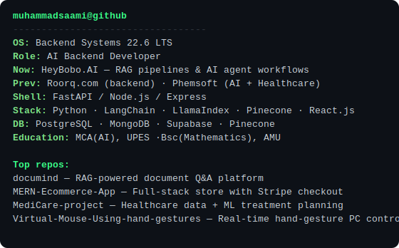
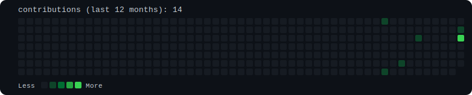

<table>
<tr>
<td valign="top" align="center"></td>
<td valign="top"></td>
</tr>
</table>

---

### muhammadsaami@github ~ %

AI Backend Developer building RAG pipelines, AI agent workflows, and the FastAPI
backends that hold them together. Currently at **HeyBobo.AI**, previously
Roorq.com and Phemsoft Technologies.

**Pinned work**

- [`documind`](https://github.com/muhammadsaami/documind) — RAG-powered document Q&A platform (FastAPI, LangChain, Pinecone)
- [`MERN-Ecommerce-App`](https://github.com/muhammadsaami/MERN-Ecommerce-App) — full-stack store with Stripe checkout
- [`MediCare-project`](https://github.com/muhammadsaami/MediCare-project) — healthcare data + ML treatment planning
- [`Virtual-Mouse-Using-hand-gestures-project`](https://github.com/muhammadsaami/Virtual-Mouse-Using-hand-gestures-project) — real-time hand-gesture PC control
- - [`Enterprise-RAG-PDF-Chatbot-Platform`](https://github.com/muhammadsaami/Enterprise-RAG-PDF-Chatbot-Platform) — production-grade RAG platform, multi-tenant workspaces, live pipeline monitoring & analytics dashboard

**Reach me:** saamikhan7310@gmail.com · [linkedin.com/in/muhammadsaami](https://linkedin.com/in/muhammadsaami)

---

Heatmap regenerates daily via GitHub Actions using live contribution data — see <code>.github/workflows/update-heatmap.yml</code>.
